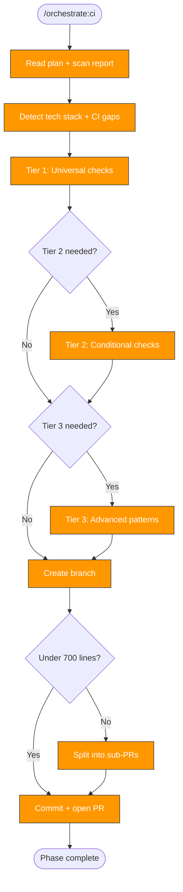

> Follow this diagram as the workflow.

# Orchestrate: CI

Add comprehensive CI workflows to a target repository. This is Phase 4 and
produces PR #3. Encodes the kagenti/kagenti gold standard: lint, test, build,
security scanning, dependency management, and supply chain hardening.

## When to Use

- After `orchestrate:plan` identifies CI as a needed phase
- After precommit and tests phases (so CI can run the test suite)

## Prerequisites

- Plan exists at `/tmp/kagenti/orchestrate/<target>/plan.md`
- Scan report at `/tmp/kagenti/orchestrate/<target>/scan-report.md`
- Target repo in `.repos/<target>/`

## Read Scan Report First

Before generating anything, read the scan report to determine:
- Tech stack (Python, Go, Node, Ansible, Rust, multi-language)
- Existing CI workflows (what to preserve vs replace)
- Dockerfiles present (triggers container build workflows)
- Existing dependabot config (what ecosystems are covered)
- Existing security scanning (what's already in place)

---

## Tier 1: Universal Checks (Always Generate)

Every repo gets these regardless of tech stack.

### 1.1 Core CI Workflow (`ci.yml`)

**Trigger:** `pull_request` on `main` and `push` to `main`

Adapt to tech stack from scan report:

| Language | Lint | Test | Build |
|----------|------|------|-------|
| Python | `ruff check .` + `ruff format --check .` | `pytest -v` | `uv build` (if pyproject.toml has build-system) |
| Go | `golangci-lint run` | `go test ./... -v -race` | `go build ./...` |
| Node | `npm run lint` | `npm test` | `npm run build` |
| Rust | `cargo clippy -- -D warnings` | `cargo test` | `cargo build --release` |
| Ansible | `ansible-lint` | `molecule test` (if molecule config exists) | — |

For multi-language repos, create separate jobs per language.

All CI workflows MUST include:
- `permissions: contents: read` (explicit least-privilege)
- `timeout-minutes: 15` (prevent hung jobs)
- Language-appropriate dependency caching
- Pre-commit run (if `.pre-commit-config.yaml` exists): `pre-commit run --all-files`

For simpler single-language repos, combine lint + test + build into one `ci.yml`.
For larger repos, split into `lint.yml`, `test.yml`, `build.yml`.

### 1.2 Security Scans Workflow (`security-scans.yml`)

**Trigger:** `pull_request` on `main`

Generate parallel jobs based on what's in the repo. Always include dependency
review. Add language-specific SAST and file-type linters only when relevant files
exist.

**Required permissions pattern:**

```yaml
permissions: {}  # Top-level: deny all

jobs:
  dependency-review:
    runs-on: ubuntu-latest
    permissions:
      contents: read
      pull-requests: write
    steps:
      - uses: actions/checkout@<SHA>  # Always SHA-pinned
      - uses: actions/dependency-review-action@<SHA>
        with:
          fail-on-severity: moderate
          deny-licenses: GPL-3.0, AGPL-3.0
```

**Conditional jobs (include only when relevant files exist):**

| Job | When to Include | Tool |
|-----|----------------|------|
| Dependency review | Always | `actions/dependency-review-action` |
| Trivy filesystem | Always | `aquasecurity/trivy-action` (fs scan, CRITICAL+HIGH) |
| CodeQL | Python or Go or JS/TS | `github/codeql-action` with `security-extended` |
| Bandit | Python files exist | `PyCQA/bandit` (HIGH severity blocks) |
| gosec | Go files exist | `securego/gosec` |
| Hadolint | Dockerfiles exist | `hadolint/hadolint-action` |
| Shellcheck | `.sh` files exist | `ludeeus/action-shellcheck` |
| YAML lint | `.yml`/`.yaml` in workflows/charts | `ibiqlik/action-yamllint` |
| Helm lint | `Chart.yaml` exists | `helm lint` |
| Action pinning | `.github/workflows/` exists | Custom step or `zgosalvez/github-actions-ensure-sha-pinned-actions` |

**Trivy reference config:**

```yaml
  trivy-scan:
    runs-on: ubuntu-latest
    permissions:
      contents: read
      security-events: write
    steps:
      - uses: actions/checkout@<SHA>
      - uses: aquasecurity/trivy-action@<SHA>
        with:
          scan-type: fs
          scan-ref: .
          severity: CRITICAL,HIGH
          exit-code: 1
          format: sarif
          output: trivy-results.sarif
      - uses: github/codeql-action/upload-sarif@<SHA>
        if: always()
        with:
          sarif_file: trivy-results.sarif
```

**CodeQL reference config:**

```yaml
  codeql:
    runs-on: ubuntu-latest
    permissions:
      security-events: write
      contents: read
    steps:
      - uses: actions/checkout@<SHA>
      - uses: github/codeql-action/init@<SHA>
        with:
          languages: ${{ matrix.language }}
          queries: security-extended
      - uses: github/codeql-action/analyze@<SHA>
```

### 1.3 Dependabot Configuration (`dependabot.yml`)

Generate `.github/dependabot.yml` covering ALL detected ecosystems:

```yaml
version: 2
updates:
  # Always include GitHub Actions
  - package-ecosystem: github-actions
    directory: /
    schedule:
      interval: weekly
```

**Add per detected ecosystem:**

| Marker File | Ecosystem | Directory |
|-------------|-----------|-----------|
| `pyproject.toml` or `requirements.txt` | `pip` | `/` (or subdir) |
| `go.mod` | `gomod` | `/` (or subdir) |
| `package.json` | `npm` | `/` (or subdir) |
| `Cargo.toml` | `cargo` | `/` (or subdir) |
| `Dockerfile` | `docker` | `/` (or subdir with Dockerfiles) |

For monorepo structures with multiple `go.mod` or `pyproject.toml` files,
add separate entries for each directory.

### 1.4 OpenSSF Scorecard Workflow (`scorecard.yml`)

```yaml
name: Scorecard
on:
  push:
    branches: [main]
  schedule:
    - cron: "30 6 * * 1"  # Weekly Monday 6:30 AM UTC
  workflow_dispatch:

permissions: read-all

jobs:
  analysis:
    runs-on: ubuntu-latest
    permissions:
      security-events: write
      id-token: write
    steps:
      - uses: actions/checkout@<SHA>
        with:
          persist-credentials: false
      - uses: ossf/scorecard-action@<SHA>
        with:
          results_file: results.sarif
          results_format: sarif
          publish_results: true
      - uses: actions/upload-artifact@<SHA>
        with:
          name: scorecard-results
          path: results.sarif
          retention-days: 30
      - uses: github/codeql-action/upload-sarif@<SHA>
        with:
          sarif_file: results.sarif
```

### 1.5 Action Pinning Check

Add as a job in `security-scans.yml` or standalone:

```yaml
  action-pinning:
    runs-on: ubuntu-latest
    permissions:
      contents: read
    steps:
      - uses: actions/checkout@<SHA>
      - name: Check action pinning
        uses: zgosalvez/github-actions-ensure-sha-pinned-actions@<SHA>
        with:
          allowlist: |
            actions/
```

Start as informational (`continue-on-error: true`). Recommend tightening
after all actions are SHA-pinned.

---

## Tier 2: Conditional Checks (Based on Scan Report)

### 2.1 Container Build Workflow (`build.yml`)

**Include when:** Dockerfiles detected in scan report.

**Trigger:** Tag push (`v*`) and `workflow_dispatch`

Generate multi-arch build matrix:

```yaml
strategy:
  matrix:
    image:
      - name: <image-name>
        context: <path-to-dockerfile-dir>
        file: <Dockerfile-path>
```

Use `docker/build-push-action` with:
- QEMU for multi-arch (amd64 + arm64)
- Buildx
- GHCR push (`ghcr.io/${{ github.repository }}/<image>`)
- OCI labels via `docker/metadata-action`

### 2.2 Stale Issues Workflow (`stale.yml`)

**Include when:** Repo is actively maintained (has recent commits).

Use the kagenti org reusable workflow:

```yaml
name: Close Stale Issues and PRs
on:
  schedule:
    - cron: "30 6 * * *"
  workflow_dispatch:

jobs:
  stale:
    uses: kagenti/.github/.github/workflows/stale.yaml@main
```

### 2.3 PR Title Verification

**Include when:** Repo follows conventional commit format.

Use the org reusable workflow or `amannn/action-semantic-pull-request`.

---

## Tier 3: Advanced Patterns (User Confirms)

Flag these in the PR description as optional. Only generate if the scan report
indicates they are needed AND the user confirms.

### 3.1 Comment-Triggered E2E (`e2e-pr.yml`)

For repos with expensive E2E tests that require secrets:

- Use `issue_comment` trigger (not `pull_request_target`)
- Authorization job: check commenter has write permission
- Add `safe-to-test` label flow
- Pair with `remove-safe-to-test.yml` for TOCTOU protection

### 3.2 Post-Merge Security Scan (`security-post-merge.yml`)

For repos where PR security scans are informational but post-merge should
upload to GitHub Security tab:

- Trigger on push to main (path-filtered to dependency files)
- Full Trivy scan with SARIF upload
- `continue-on-error: true` (never blocks main)

### 3.3 TOCTOU Protection (`remove-safe-to-test.yml`)

Pair with comment-triggered E2E:

- Trigger: `pull_request_target` on `synchronize`
- Remove `safe-to-test` label on new commits
- Post security checklist comment for maintainers

---

## Action Version Reference

When generating workflows, use the latest SHA-pinned versions. Look up current
SHAs from the kagenti/kagenti main repo's workflows as the reference. All
actions MUST be SHA-pinned with a version comment:

```yaml
- uses: actions/checkout@<full-sha>  # v4
```

**Never use tag-only references** like `@v4`.

---

## Skills to Push Alongside

Include in the target's `.claude/skills/`:
- `ci:status` — Check CI pipeline status
- `rca:ci` — Root cause analysis from CI logs

---

## Branch and PR Workflow

```bash
git -C .repos/<target> checkout -b orchestrate/ci
```

### PR size check

```bash
git -C .repos/<target> diff --stat | tail -1
```

Target ~600-700 lines. If over 700, split:
- PR 3a: `ci.yml` + `dependabot.yml`
- PR 3b: `security-scans.yml` + `scorecard.yml`
- PR 3c: Container builds (if applicable)

### Commit and push

```bash
git -C .repos/<target> add -A
```

```bash
git -C .repos/<target> commit -s -m "feat: add comprehensive CI workflows (lint, test, build, security, dependabot, scorecard)"
```

```bash
git -C .repos/<target> push -u origin orchestrate/ci
```

### Create PR

```bash
gh pr create --repo org/repo --title "Add comprehensive CI workflows" --body "Phase 4 of repo orchestration. Adds GitHub Actions for lint, test, build, security scanning (Trivy, CodeQL, SAST), dependabot for all ecosystems, OpenSSF Scorecard, and action pinning verification."
```

## Update Phase Status

Set ci to `complete` in `/tmp/kagenti/orchestrate/<target>/phase-status.md`.

## Related Skills

- `orchestrate` — Parent router
- `orchestrate:tests` — Previous phase (test suite to run in CI)
- `orchestrate:plan` — Defines CI phase tasks
- `orchestrate:security` — Next phase: governance hardening
