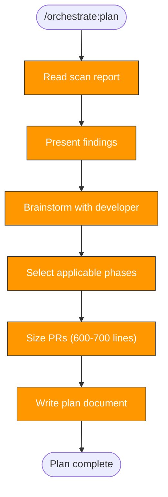

> Follow this diagram as the workflow.

# Orchestrate: Plan

Take the scan report and turn it into a concrete phased enhancement plan. This
is Phase 1 — interactive brainstorming with the developer, no PRs.

## When to Use

- After `orchestrate:scan` has produced a scan report
- Before starting any PR-producing phase

## Prerequisites

Scan report must exist:

```bash
cat /tmp/kagenti/orchestrate/<target>/scan-report.md
```

## Planning Process

### 1. Read the scan report

Review the Gap Summary and Recommended Phases sections.

### 2. Present findings to developer

Summarize the key gaps in plain language. Use AskUserQuestion to confirm
understanding and gather context about the repo's priorities.

### 3. Brainstorm which phases apply

Not all repos need all phases. Use AskUserQuestion to decide:

| Gap Found | Phase | Default |
|-----------|-------|---------|
| No pre-commit config | `orchestrate:precommit` | Always (foundation) |
| No/incomplete CI workflows or security scanning | `orchestrate:ci` | Yes if missing |
| No/few tests (<5 test files) | `orchestrate:tests` | Yes if low coverage |
| No CODEOWNERS/SECURITY.md/LICENSE | `orchestrate:security` | Recommended |
| No `.claude/skills/` directory | `orchestrate:replicate` | Always (last phase) |

### 4. Determine phase order

Default order: precommit → tests → ci → security → replicate

Tests come before CI (so CI can run them) and before security (so code
refactoring for security fixes has test coverage as a safety net). Pre-commit
is always first (it validates subsequent PRs). Replicate is always last.

### 5. Size PRs

Target 600-700 lines per PR. For each phase:
- If estimated >700 lines: split into sub-PRs by concern
- If estimated <300 lines: merge with adjacent phase
- Skills pushed alongside each phase count toward the total

### 6. Write the plan document

## Plan Output

Save to `/tmp/kagenti/orchestrate/<target>/plan.md`:

```markdown
# Enhancement Plan: <target>

**Generated from scan:** YYYY-MM-DD
**Tech stack:** <language>
**Phases:** <count>

## Phase 2: Pre-commit (PR #1, ~NNN lines)
- [ ] Add .pre-commit-config.yaml
- [ ] Add linting config
- [ ] Create CLAUDE.md
- [ ] Create .claude/settings.json
- [ ] Add repo:commit skill

## Phase 3: Tests (PR #2, ~NNN lines)
- [ ] Set up test framework
- [ ] Add test configuration
- [ ] Write initial tests for critical paths
- [ ] Add test:write and tdd:ci skills

## Phase 4: CI (PR #3, ~NNN lines)
- [ ] Add lint/test/build workflow (ci.yml)
- [ ] Add security scanning workflow (security-scans.yml)
- [ ] Add dependabot.yml (all detected ecosystems)
- [ ] Add scorecard workflow
- [ ] Add action pinning verification
- [ ] Add container build workflow (if Dockerfiles exist)
- [ ] Add ci:status and rca:ci skills

## Phase 5: Security Governance (PR #4, ~NNN lines)
- [ ] Create CODEOWNERS
- [ ] Create SECURITY.md
- [ ] Create CONTRIBUTING.md
- [ ] Verify/add LICENSE
- [ ] Audit .gitignore

## Phase 6: Replicate (PR #5)
- [ ] Copy orchestrate:* skills to target
- [ ] Adapt references
- [ ] Update CLAUDE.md
- [ ] Validate skills
```

## After Planning

Initialize phase tracking:

```bash
cat > /tmp/kagenti/orchestrate/<target>/phase-status.md << 'EOF'
# Phase Status: <target>

| Phase | Status | PR | Date |
|-------|--------|----|------|
| scan | complete | — | YYYY-MM-DD |
| plan | complete | — | YYYY-MM-DD |
| precommit | pending | | |
| tests | pending | | |
| ci | pending | | |
| security | pending | | |
| replicate | pending | | |
EOF
```

Then invoke the first applicable phase skill (usually `orchestrate:precommit`).

## Related Skills

- `orchestrate` — Parent router
- `orchestrate:scan` — Prerequisite: produces the scan report
- `orchestrate:precommit` — Usually the first PR-producing phase
