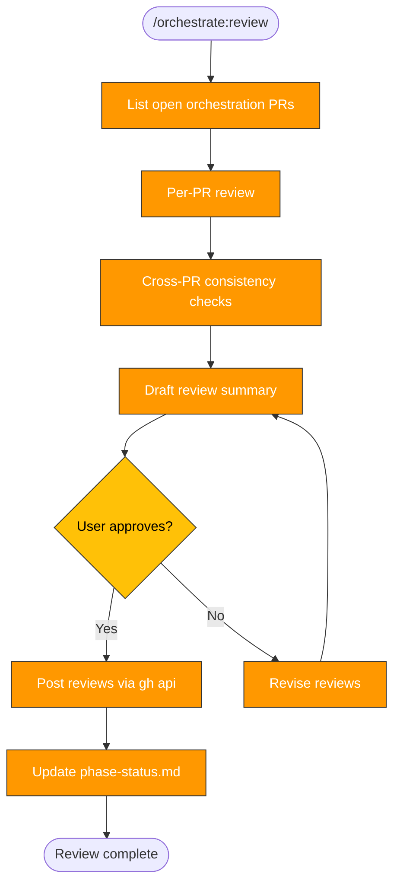

> Follow this diagram as the workflow.

# Orchestrate: Review

Phase 7 quality gate. Review all orchestration PRs created by phases 2-6 before
merge. Checks each PR individually, then validates cross-PR consistency, and
submits reviews after user approval.

## When to Use

- After all orchestration phases (2-6) have created their PRs
- Before merging any orchestration PRs into the target repo
- When `/orchestrate review` is invoked from the router

## Prerequisites

- `scan-report.md` and `plan.md` exist in `/tmp/kagenti/orchestrate/<target>/`
- Phases 2-6 are complete (or at least the phases that were planned)
- PRs are open on the target repo

## Phase 1: Gather

List open PRs for the target repo and collect metadata:

```bash
# List open PRs created by orchestration (look for orchestrate-related branch names or labels)
gh pr list --repo <org>/<repo> --state open --json number,title,headRefName,additions,deletions,files
```

For each PR, fetch the diff:

```bash
gh pr diff <number> --repo <org>/<repo>
```

Record PR metadata in a working table:

| PR | Title | Branch | Files | +/- |
|----|-------|--------|-------|-----|
| #N | ... | orchestrate/... | N | +X/-Y |

## Phase 2: Per-PR Review

For each PR, run the `github:pr-review` checklist:

### Commit Conventions
- Signed-off (`Signed-off-by:` trailer present)
- Emoji prefix on commit message (if repo convention requires it)
- Imperative mood in subject line
- Body explains "why" not just "what"

### PR Format
- Title under 70 characters
- Summary section in PR body
- Links to relevant issues or plan

### Area-Specific Checks

| PR Phase | Checks |
|----------|--------|
| precommit (Phase 2) | `.pre-commit-config.yaml` valid YAML, hooks match detected languages, no conflicting formatters |
| tests (Phase 3) | Test files follow naming conventions, fixtures are reusable, no hardcoded secrets in tests |
| ci (Phase 4) | Actions SHA-pinned, permissions least-privilege, no secrets in logs, workflows valid YAML |
| security (Phase 5) | CODEOWNERS paths exist, SECURITY.md has contact info, LICENSE matches repo intent |
| replicate (Phase 6) | Skills have frontmatter, SKILL.md files are valid markdown, paths reference target repo correctly |

### Security Review
- No secrets, tokens, or credentials in diff
- No overly permissive file permissions
- No `eval`, `exec`, or injection-prone patterns in scripts
- Container images use specific tags (not `:latest`)

## Phase 3: Cross-PR Consistency

Check alignment across all orchestration PRs:

### Pre-commit ↔ CI Alignment
- Linters configured in `.pre-commit-config.yaml` (Phase 2) should match lint steps
  in CI workflows (Phase 4)
- Example: if pre-commit runs `ruff`, CI should also run `ruff` (or at least not
  run a conflicting linter like `flake8`)

```bash
# Extract pre-commit hooks
grep "repo:\|id:" .repos/<target>/.pre-commit-config.yaml 2>/dev/null
# Compare with CI lint steps
grep -A5 "lint\|check\|format" .repos/<target>/.github/workflows/*.yml 2>/dev/null
```

### Tests ↔ CI Alignment
- Tests added in Phase 3 should be executed by CI workflows added in Phase 4
- Check that test commands in CI match the test framework detected

```bash
# Test framework from Phase 3
grep -r "pytest\|go test\|vitest\|jest" .repos/<target>/.github/workflows/*.yml 2>/dev/null
```

### CODEOWNERS ↔ Paths
- Paths in CODEOWNERS (Phase 5) should cover directories created by earlier phases

```bash
# Check CODEOWNERS paths exist
cat .repos/<target>/CODEOWNERS 2>/dev/null | grep -v "^#" | awk '{print $1}' | while read path; do
  ls .repos/<target>/$path 2>/dev/null || echo "MISSING: $path"
done
```

### Skills ↔ Repo Paths
- Skills replicated in Phase 6 should reference correct paths for the target repo
- Skill frontmatter should be valid

```bash
# Check skill files have valid frontmatter
find .repos/<target>/.claude/skills -name "SKILL.md" -exec head -5 {} \; 2>/dev/null
```

## Phase 4: Draft

Present a review summary to the user. Format:

```markdown
# Orchestration Review: <target>

## Per-PR Verdicts

| PR | Title | Verdict | Issues |
|----|-------|---------|--------|
| #N | precommit: ... | approve | 0 |
| #N | tests: ... | request-changes | 2 |
| #N | ci: ... | approve | 0 |
| #N | security: ... | comment | 1 |
| #N | replicate: ... | approve | 0 |

## Issues Found

### PR #N: <title>
1. **[severity]** Description of issue
   - File: `path/to/file`
   - Recommendation: ...

## Cross-PR Consistency

| Check | Status | Notes |
|-------|--------|-------|
| Pre-commit ↔ CI lint | aligned/misaligned | details |
| Tests ↔ CI execution | aligned/misaligned | details |
| CODEOWNERS ↔ paths | aligned/misaligned | details |
| Skills ↔ repo paths | aligned/misaligned | details |
```

Present this to the user and wait for approval before submitting.

## Phase 5: Submit

After user approval, post reviews via GitHub API:

```bash
# For each PR, post the review
gh api repos/<org>/<repo>/pulls/<number>/reviews \
  --method POST \
  -f event="APPROVE" \
  -f body="Orchestration review: all checks passed. ..."

# Or for request-changes:
gh api repos/<org>/<repo>/pulls/<number>/reviews \
  --method POST \
  -f event="REQUEST_CHANGES" \
  -f body="Orchestration review: issues found. ..."
```

For PRs with inline comments, use the review comments API:

```bash
gh api repos/<org>/<repo>/pulls/<number>/reviews \
  --method POST \
  -f event="REQUEST_CHANGES" \
  -f body="..." \
  --input comments.json
```

Where `comments.json` contains file-level comments.

## Status Update

Update `phase-status.md` when complete:

```bash
# Update phase-status.md
sed -i '' 's/| review .*/| review | complete | -- | YYYY-MM-DD |/' /tmp/kagenti/orchestrate/<target>/phase-status.md
```

## Related Skills

- `orchestrate` -- Parent router
- `orchestrate:scan` -- Scan report used for cross-referencing
- `orchestrate:plan` -- Plan used to verify all phases were executed
