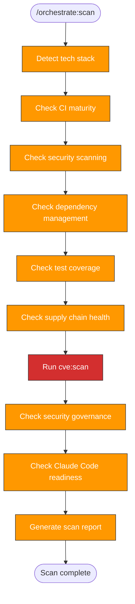

> Follow this diagram as the workflow.

# Orchestrate: Scan

Assess a target repository's current state to determine what orchestration
phases are needed. This is Phase 0 — produces artifacts only, no PRs.

## When to Use

- First step when orchestrating a new repo
- Re-run after major changes to reassess gaps
- Before running `orchestrate:plan`

## Prerequisites

Target repo cloned into `.repos/<target>/`:

```bash
git clone git@github.com:org/repo.git .repos/<target>
```

## Technology Detection

Check for marker files to identify the tech stack:

```bash
ls .repos/<target>/go.mod .repos/<target>/pyproject.toml .repos/<target>/package.json .repos/<target>/Cargo.toml .repos/<target>/requirements.yml 2>/dev/null
```

| Marker | Language | Lint Tool | Test Tool | Build Tool |
|--------|----------|-----------|-----------|------------|
| `go.mod` | Go | golangci-lint | go test | go build |
| `pyproject.toml` | Python | ruff | pytest | uv build |
| `package.json` | Node.js | eslint | jest/vitest | npm build |
| `Cargo.toml` | Rust | clippy | cargo test | cargo build |
| `requirements.yml` | Ansible | ansible-lint | molecule | — |

For multi-language repos (e.g., Go + Python + Helm), note all detected stacks.

Also check for:
- Dockerfiles: `find .repos/<target> -name "Dockerfile*" -type f`
- Helm charts: `find .repos/<target> -name "Chart.yaml" -type f`
- Shell scripts: `find .repos/<target> -name "*.sh" -type f`
- Makefiles: `ls .repos/<target>/Makefile`

## Scan Checks

### CI Status

```bash
ls .repos/<target>/.github/workflows/ 2>/dev/null
```

For each workflow found, read it and categorize:

| Category | What to Check |
|----------|---------------|
| Lint | Does a workflow run linters? Which ones? |
| Test | Does a workflow run tests? Are they commented out? |
| Build | Does a workflow build artifacts/images? |
| Security | Does a workflow run security scans? |
| Release | Does a workflow handle releases/tags? |

### Security Scanning Coverage

Check which security tools are configured in CI:

| Tool | How to Detect | Purpose |
|------|---------------|---------|
| Trivy | `trivy-action` in workflows | Filesystem/container/IaC scanning |
| CodeQL | `codeql-action` in workflows | SAST for supported languages |
| Bandit | `bandit` in workflows or pre-commit | Python SAST |
| gosec | `gosec` in workflows | Go SAST |
| Hadolint | `hadolint` in workflows or pre-commit | Dockerfile linting |
| Shellcheck | `shellcheck` in workflows or pre-commit | Shell script linting |
| Dependency review | `dependency-review-action` in workflows | PR dependency audit |
| Scorecard | `scorecard-action` in workflows | OpenSSF supply chain |
| Gitleaks | `gitleaks` in workflows or pre-commit | Secret detection |

Score: count how many of the applicable tools are present vs expected.

### Dependency Management

```bash
cat .repos/<target>/.github/dependabot.yml 2>/dev/null || echo "MISSING"
```

Check which ecosystems are covered vs what's in the repo:

| In Repo | Expected Ecosystem | Covered? |
|---------|-------------------|----------|
| `pyproject.toml` | pip | ? |
| `go.mod` | gomod | ? |
| `package.json` | npm | ? |
| `Dockerfile` | docker | ? |
| `.github/workflows/` | github-actions | ? |

### Action Pinning Compliance

```bash
grep -r "uses:" .repos/<target>/.github/workflows/ 2>/dev/null | grep -v "@[a-f0-9]\{40\}" | head -20
```

Count actions pinned to SHA vs tag-only. Report compliance percentage.

### Permissions Model

Check workflow files for:
- Top-level `permissions: {}` or `permissions: read-all` (good)
- Per-job `permissions:` blocks (good)
- No permissions declaration (bad — gets full default token permissions)

```bash
grep -l "^permissions:" .repos/<target>/.github/workflows/*.yml 2>/dev/null
```

### Test Coverage

Categorize tests into 4 areas. For each, detect frameworks, count files/functions,
check coverage tooling, and verify CI execution.

#### Backend Tests

Detect framework from marker files:

```bash
# Python
grep -q "pytest" .repos/<target>/pyproject.toml 2>/dev/null && echo "pytest"
# Go
ls .repos/<target>/go.mod 2>/dev/null && echo "go test"
# Go + Ginkgo
grep -q "ginkgo" .repos/<target>/go.mod 2>/dev/null && echo "ginkgo"
```

Count test files and functions:

```bash
find .repos/<target> -type f -name "test_*.py" -o -name "*_test.py" 2>/dev/null | wc -l
find .repos/<target> -type f -name "*_test.go" 2>/dev/null | wc -l
grep -rc "def test_\|func Test" .repos/<target> --include="*.py" --include="*.go" 2>/dev/null | awk -F: '{s+=$2} END {print s}'
```

Check coverage tooling:

```bash
# Python: pytest-cov in dependencies
grep -q "pytest-cov" .repos/<target>/pyproject.toml 2>/dev/null && echo "pytest-cov found"
# Python: coverage config
grep -q "\[tool.coverage" .repos/<target>/pyproject.toml 2>/dev/null && echo "coverage config found"
# Go: -coverprofile in Makefile or CI
grep -r "\-coverprofile" .repos/<target>/Makefile .repos/<target>/.github/workflows/ 2>/dev/null
```

When coverage tooling is missing, recommend the appropriate tool:
- Python: add `pytest-cov>=4.0` to dev deps and `[tool.coverage.run] source = ["src"]` to pyproject.toml
- Go: add `-coverprofile=coverage.out` to `go test` invocation in Makefile/CI

#### UI Tests

Detect framework from package.json:

```bash
grep -E "playwright|jest|vitest" .repos/<target>/*/package.json .repos/<target>/package.json 2>/dev/null
```

Count spec files and test blocks:

```bash
find .repos/<target> -type f \( -name "*.spec.ts" -o -name "*.spec.tsx" -o -name "*.test.ts" -o -name "*.test.tsx" \) 2>/dev/null | wc -l
grep -rc "test(\|it(\|describe(" .repos/<target> --include="*.spec.*" --include="*.test.*" 2>/dev/null | awk -F: '{s+=$2} END {print s}'
```

Note: for Playwright E2E-style UI tests, code coverage is typically not applicable.
For unit-test-style UI tests (jest/vitest), check for istanbul/c8 coverage config.

#### E2E Tests

Count test files and functions:

```bash
find .repos/<target> -path "*/e2e/*" -type f -name "test_*.py" 2>/dev/null | wc -l
grep -rc "def test_" .repos/<target>/*/tests/e2e/ .repos/<target>/tests/e2e/ 2>/dev/null | awk -F: '{s+=$2} END {print s}'
```

Build a feature coverage map by scanning test filenames and imports:

```bash
# List E2E test files to identify which features are covered
find .repos/<target> -path "*/e2e/*" -name "test_*.py" -exec basename {} \; 2>/dev/null | sort
```

Map each test file to a platform feature (e.g., `test_keycloak.py` → Keycloak auth,
`test_shipwright_build.py` → Shipwright builds). Identify features present in the
codebase that lack E2E tests.

Build a CI trigger matrix:

```bash
# Which workflows run E2E tests, on which triggers and platforms?
grep -l "e2e\|E2E" .repos/<target>/.github/workflows/*.yml 2>/dev/null
```

For each E2E workflow, note the trigger events (push/PR/manual) and target
platforms (Kind/OCP/HyperShift).

#### Infra Tests

Infra testing is about variant coverage, not code coverage. Score as a variant matrix.

Scan for deployment targets:

```bash
# Which platforms appear in CI workflows and scripts?
grep -rl "kind\|Kind\|KIND" .repos/<target>/.github/workflows/ 2>/dev/null
grep -rl "openshift\|OpenShift\|OCP" .repos/<target>/.github/workflows/ 2>/dev/null
grep -rl "hypershift\|HyperShift" .repos/<target>/.github/workflows/ 2>/dev/null
```

Scan values files for toggle combos:

```bash
# Which feature toggles exist in Helm values files?
find .repos/<target> -path "*/envs/*" -name "values*.yaml" 2>/dev/null
# Check for toggle patterns
grep -r "enabled:" .repos/<target>/deployments/envs/ .repos/<target>/charts/*/values.yaml 2>/dev/null | head -20
```

Check static validation in CI:

```bash
grep -rl "helm lint\|helm template" .repos/<target>/.github/workflows/ 2>/dev/null && echo "helm lint: in CI"
grep -rl "shellcheck" .repos/<target>/.github/workflows/ .repos/<target>/.pre-commit-config.yaml 2>/dev/null && echo "shellcheck: in CI"
grep -rl "hadolint" .repos/<target>/.github/workflows/ .repos/<target>/.pre-commit-config.yaml 2>/dev/null && echo "hadolint: in CI"
grep -rl "yamllint" .repos/<target>/.github/workflows/ .repos/<target>/.pre-commit-config.yaml 2>/dev/null && echo "yamllint: in CI"
```

### CVE Scan

Invoke `cve:scan` against the target repo to detect known vulnerabilities in
dependencies. This runs the full cve:scan procedure (inventory → Trivy → LLM +
WebSearch → findings report).

The scan operates on the target repo working directory:

```bash
cd .repos/<target>
```

Then follow the `cve:scan` skill workflow:
1. **Inventory** — find all dependency files (pyproject.toml, go.mod, package.json,
   Dockerfile, Chart.yaml, requirements*.txt, uv.lock)
2. **Trivy** (if installed) — filesystem scan with `--severity HIGH,CRITICAL`
3. **LLM + WebSearch** — cross-reference dependencies against NVD/OSV/GitHub
   Advisory Database
4. **Classify** — confirmed / suspected / false positive

Write CVE findings to `/tmp/kagenti/cve/<target>/scan-report.json` (never to
git-tracked files). Include a summary in the scan report.

Key areas to focus on:
- Crypto/auth libraries (cryptography, pyjwt, golang.org/x/crypto, oauth2)
- Network libraries (httpx, requests, grpcio, golang.org/x/net)
- Serialization (protobuf, pydantic)
- Container base images (EOL versions, unpinned tags)
- Abandoned/deprecated libraries (e.g., dgrijalva/jwt-go)

### Pre-commit Hooks

```bash
cat .repos/<target>/.pre-commit-config.yaml 2>/dev/null
```

If present, list which hooks are configured.

### Security Governance

```bash
ls .repos/<target>/CODEOWNERS .repos/<target>/.github/CODEOWNERS 2>/dev/null
ls .repos/<target>/SECURITY.md 2>/dev/null
ls .repos/<target>/CONTRIBUTING.md 2>/dev/null
ls .repos/<target>/LICENSE 2>/dev/null
```

### Claude Code Readiness

```bash
ls .repos/<target>/CLAUDE.md .repos/<target>/.claude/settings.json 2>/dev/null
```

```bash
ls .repos/<target>/.claude/skills/ 2>/dev/null
```

### Git Health

```bash
git -C .repos/<target> log --oneline -5
```

```bash
git -C .repos/<target> remote -v
```

## Output Format

Save scan report to `/tmp/kagenti/orchestrate/<target>/scan-report.md`:

```bash
mkdir -p /tmp/kagenti/orchestrate/<target>
```

Report template:

```markdown
# Scan Report: <target>

**Date:** YYYY-MM-DD
**Tech Stack:** <languages, frameworks>
**Maturity Score:** N/5

## CI Status
- Workflows found: [list or "none"]
- Covers: lint / test / build / security / release
- Tests in CI: running / commented out / missing

## Security Scanning
| Tool | Status | Notes |
|------|--------|-------|
| Trivy | present/missing | |
| CodeQL | present/missing/n-a | |
| Bandit/gosec | present/missing/n-a | |
| Hadolint | present/missing/n-a | |
| Shellcheck | present/missing/n-a | |
| Dependency review | present/missing | |
| Scorecard | present/missing | |
| Gitleaks | present/missing | |

## Dependency Management
- Dependabot config: yes/no
- Ecosystems covered: [list]
- Ecosystems missing: [list]

## Supply Chain Health
- Action pinning: N% SHA-pinned (N/M actions)
- Permissions model: least-privilege / default / mixed
- Unpinned actions: [list top offenders]

## Test Coverage

### Backend Tests
- Framework: [pytest X.x / go test / ginkgo vX.x / none]
- Test files: N
- Test functions: ~M
- Coverage tool: [pytest-cov / -coverprofile / missing]
- Coverage config: [present / missing (recommend: ...)]
- CI execution: [running in workflow.yaml / missing]

### UI Tests
- Framework: [Playwright X.x / jest / vitest / none]
- Spec files: N
- Test blocks: ~M
- Coverage tool: [istanbul / c8 / n/a (E2E)]
- CI execution: [running in workflow.yaml / missing]

### E2E Tests
- Test files: N
- Test functions: ~M
- Feature coverage:
  | Feature | Test File | Status |
  |---------|-----------|--------|
  | [feature] | [test file] | covered/missing |
- CI trigger matrix:
  | Platform | Push | PR | Manual |
  |----------|------|-----|--------|
  | [platform] | [workflow] | [workflow] | — |

### Infra Tests
- Deployment variants tested:
  | Variant | CI Workflow | Values File |
  |---------|------------|-------------|
  | [platform + version] | [workflow] | [values file] |
- Value variant coverage:
  | Feature Toggle | Tested On | Tested Off |
  |---------------|-----------|------------|
  | [toggle] | [platforms] | [platforms or —] |
- Static validation:
  | Check | Status |
  |-------|--------|
  | Helm lint | in CI / missing |
  | shellcheck | in CI / missing |
  | hadolint | in CI / missing / n-a |
  | yamllint | in CI / missing |

## Pre-commit
- Config found: yes/no
- Hooks: [list or "none"]

## Security Governance
- CODEOWNERS: yes/no
- SECURITY.md: yes/no
- CONTRIBUTING.md: yes/no
- LICENSE: yes/no (type if present)
- .gitignore secrets patterns: adequate/needs-review

## Claude Code Readiness
- CLAUDE.md: yes/no
- .claude/settings.json: yes/no
- Skills count: N

## Container Infrastructure
- Dockerfiles: N found [list paths]
- Multi-arch builds: yes/no
- Container registry: [ghcr.io/etc or "none"]
- Base image pinning: digest / tag / unpinned
- EOL base images: [list or "none"]

## Dependency Vulnerabilities (cve:scan)
- Scan method: [Trivy + LLM + WebSearch / LLM + WebSearch / LLM only]
- Full report: `/tmp/kagenti/cve/<target>/scan-report.json`

| Severity | Count |
|----------|-------|
| CRITICAL | N |
| HIGH | N |
| MEDIUM | N |
| Suspected | N |

### Confirmed Findings
| Package | Version | Severity | Issue | Fix |
|---------|---------|----------|-------|-----|
| [package] | [version] | CRITICAL/HIGH | [brief description — no CVE IDs in public output] | [fixed version or action] |

### Architectural Security Concerns
| Concern | Severity | Details |
|---------|----------|---------|
| [e.g., insecure port, no input validation] | HIGH/MEDIUM | [brief description] |

> **Note:** CVE IDs and detailed descriptions are in `/tmp/kagenti/cve/<target>/scan-report.json` only.
> Do NOT copy CVE IDs into git-tracked files, PRs, or issues.

## Gap Summary
| Area | Status | Action Needed |
|------|--------|---------------|
| Pre-commit | missing/partial/ok | orchestrate:precommit |
| Tests (backend) | missing/partial/ok | orchestrate:tests |
| Tests (UI) | missing/partial/ok/n-a | orchestrate:tests |
| Tests (E2E) | missing/partial/ok | orchestrate:tests |
| Tests (infra) | missing/partial/ok | orchestrate:ci |
| CI (lint/test/build) | missing/partial/ok | orchestrate:ci |
| CI (security scanning) | missing/partial/ok | orchestrate:ci |
| CI (dependabot) | missing/partial/ok | orchestrate:ci |
| CI (scorecard) | missing/partial/ok | orchestrate:ci |
| CI (supply chain) | missing/partial/ok | orchestrate:ci |
| Dep vulnerabilities | clean/findings/critical | cve:brainstorm / dep bump |
| Container base images | pinned/unpinned/eol | orchestrate:ci |
| Governance | missing/partial/ok | orchestrate:security |
| Skills | missing/partial/ok | orchestrate:replicate |

## Recommended Phases
1. [ordered list of phases based on gaps]
```

## Gap Analysis

Determine which phases are needed based on findings:

| Finding | Phase Needed |
|---------|-------------|
| No `.pre-commit-config.yaml` | `orchestrate:precommit` |
| No CI workflows or missing lint/test | `orchestrate:ci` |
| No security scanning in CI | `orchestrate:ci` |
| Dependabot missing or incomplete | `orchestrate:ci` |
| No scorecard workflow | `orchestrate:ci` |
| Actions not SHA-pinned | `orchestrate:ci` |
| Permissions not least-privilege | `orchestrate:ci` |
| No backend test files or <5 test functions | `orchestrate:tests` |
| Backend coverage tool missing | `orchestrate:tests` |
| No UI test specs (when UI code exists) | `orchestrate:tests` |
| No E2E tests or low feature coverage | `orchestrate:tests` |
| E2E tests not triggered in CI | `orchestrate:ci` |
| Only one deployment variant tested | `orchestrate:ci` |
| Missing static validation (helm lint, shellcheck, etc.) | `orchestrate:ci` |
| Confirmed CRITICAL/HIGH CVEs in dependencies | `cve:brainstorm` (fix before public issues) |
| Abandoned/deprecated libraries | dependency bump PR |
| EOL container base images | `orchestrate:ci` |
| Unpinned container base image tags | `orchestrate:ci` |
| No CODEOWNERS or SECURITY.md | `orchestrate:security` |
| No LICENSE | `orchestrate:security` |
| No `.claude/skills/` | `orchestrate:replicate` |

All repos get `orchestrate:precommit` (foundation) and `orchestrate:replicate`
(self-sufficiency). Other phases depend on the scan results.

## Related Skills

- `orchestrate` — Parent router
- `orchestrate:plan` — Next step: create phased plan from scan results
- `skills:scan` — Similar pattern for scanning skills specifically
