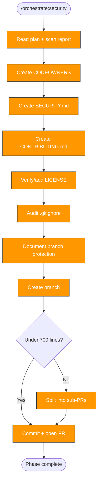

> Follow this diagram as the workflow.

# Orchestrate: Security Governance

Add security governance files to a target repository. This is Phase 5 and
produces PR #4. Focuses on governance and policy files — CI-related security
(scanning, dependabot, scorecard) is handled by `orchestrate:ci`.

## When to Use

- After `orchestrate:plan` identifies security governance as a needed phase
- After precommit, tests, and CI phases

## Prerequisites

- Plan exists with security phase
- Scan report exists (to know what's missing)
- Target repo in `.repos/<target>/`

## Step 1: CODEOWNERS

Create `CODEOWNERS` at repo root or `.github/CODEOWNERS`:

```
# Default owners for everything
* @org/team-leads

# Platform and CI
.github/ @org/platform
Makefile @org/platform

# Documentation
docs/ @org/docs-team
*.md @org/docs-team
```

Adapt teams and paths based on:
- The scan report's identified tech stack
- The org's team structure (check other repos for patterns)
- Key directories that need specialized review

## Step 2: SECURITY.md

Create `SECURITY.md` with vulnerability reporting guidance:

```markdown
# Security Policy

## Reporting a Vulnerability

Please report security vulnerabilities through GitHub Security Advisories:
**[Report a vulnerability](https://github.com/org/repo/security/advisories/new)**

Do NOT open public issues for security vulnerabilities.

## Response Timeline

- **Acknowledgment:** Within 48 hours
- **Initial assessment:** Within 7 days
- **Fix timeline:** Based on severity

## Security Controls

This repository uses:
- CI security scanning (Trivy, CodeQL)
- Dependency updates via Dependabot
- OpenSSF Scorecard monitoring
- Pre-commit hooks for local checks
```

Adapt the security controls list based on what `orchestrate:ci` actually
deployed to this repo.

## Step 3: CONTRIBUTING.md

Create `CONTRIBUTING.md` with development workflow:

```markdown
# Contributing

## Development Setup

[Adapt to tech stack from scan report]

## Pull Request Process

1. Fork the repository
2. Create a feature branch from `main`
3. Make your changes with tests
4. Run pre-commit hooks: `pre-commit run --all-files`
5. Submit a pull request

## Commit Messages

Use conventional commit format:
- `feat:` New features
- `fix:` Bug fixes
- `docs:` Documentation changes
- `chore:` Maintenance tasks

All commits must be signed off (`git commit -s`).

## Code of Conduct

[Link to org-level CoC if exists]
```

## Step 4: LICENSE

Check if LICENSE exists. If missing:
- Check the org's standard license (most kagenti repos use Apache 2.0)
- Add the appropriate LICENSE file
- If unsure, flag in the PR for maintainer decision

## Step 5: .gitignore Audit

Check for missing patterns and add them:

**Secrets and credentials:**
- `.env`, `.env.*`, `.env.local`
- `*.key`, `*.pem`, `*.p12`, `*.jks`
- `credentials.*`, `secrets.*`
- `kubeconfig`, `*kubeconfig*`

**IDE and OS files:**
- `.idea/`, `.vscode/`
- `.DS_Store`, `Thumbs.db`

**Build artifacts (language-specific):**
- Python: `__pycache__/`, `*.pyc`, `.ruff_cache/`, `dist/`, `*.egg-info/`
- Go: binary names from `go.mod` module path
- Node: `node_modules/`, `dist/`, `.next/`

Do not remove existing patterns. Only add missing ones.

## Step 6: Branch Protection Documentation

Document in the PR description (can't auto-apply via PR):

**Recommended branch protection rules for `main`:**
- Require PR reviews (minimum 1 approval)
- Require status checks to pass (list the CI checks from `orchestrate:ci`)
- Require signed commits (if org policy)
- Disable force push to main
- Require branches to be up to date before merging
- Require conversation resolution before merging

## Branch and PR Workflow

```bash
git -C .repos/<target> checkout -b orchestrate/security
```

### PR size check

```bash
git -C .repos/<target> diff --stat | tail -1
```

### Commit and push

```bash
git -C .repos/<target> add -A
```

```bash
git -C .repos/<target> commit -s -m "feat: add security governance (CODEOWNERS, SECURITY.md, CONTRIBUTING.md, .gitignore)"
```

```bash
git -C .repos/<target> push -u origin orchestrate/security
```

### Create PR

```bash
gh pr create --repo org/repo --title "Add security governance files" --body "Phase 5 of repo orchestration. Adds CODEOWNERS, SECURITY.md, CONTRIBUTING.md, LICENSE verification, and .gitignore hardening."
```

## Update Phase Status

Set security to `complete` in phase-status.md.

## Related Skills

- `orchestrate` — Parent router
- `orchestrate:ci` — Previous phase (CI-related security is there)
- `orchestrate:plan` — Defines security phase tasks
- `orchestrate:replicate` — Next phase: bootstrap skills
