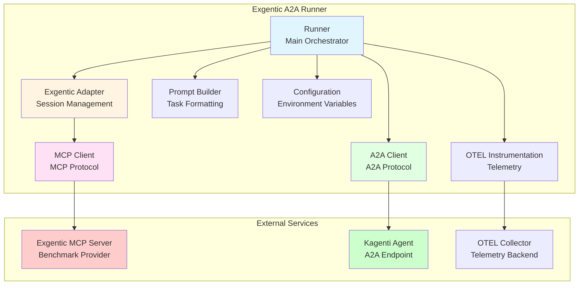
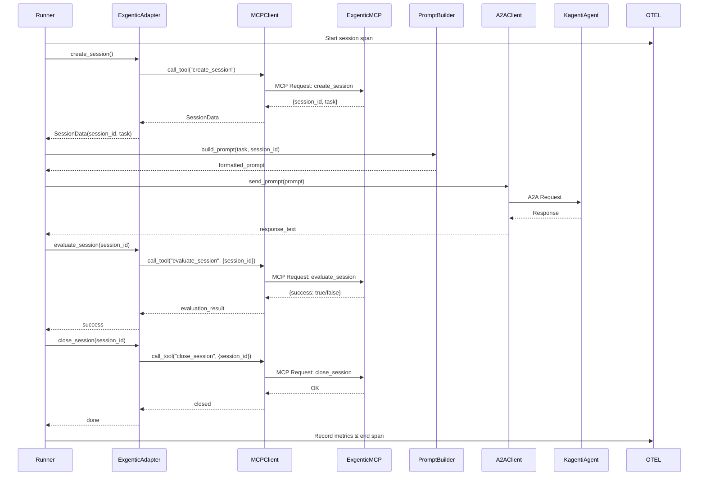
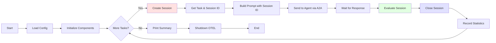
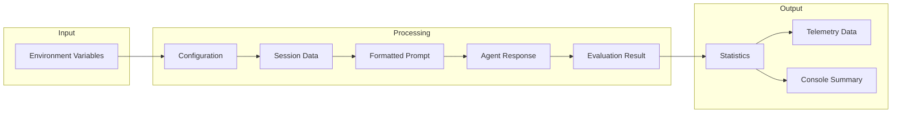
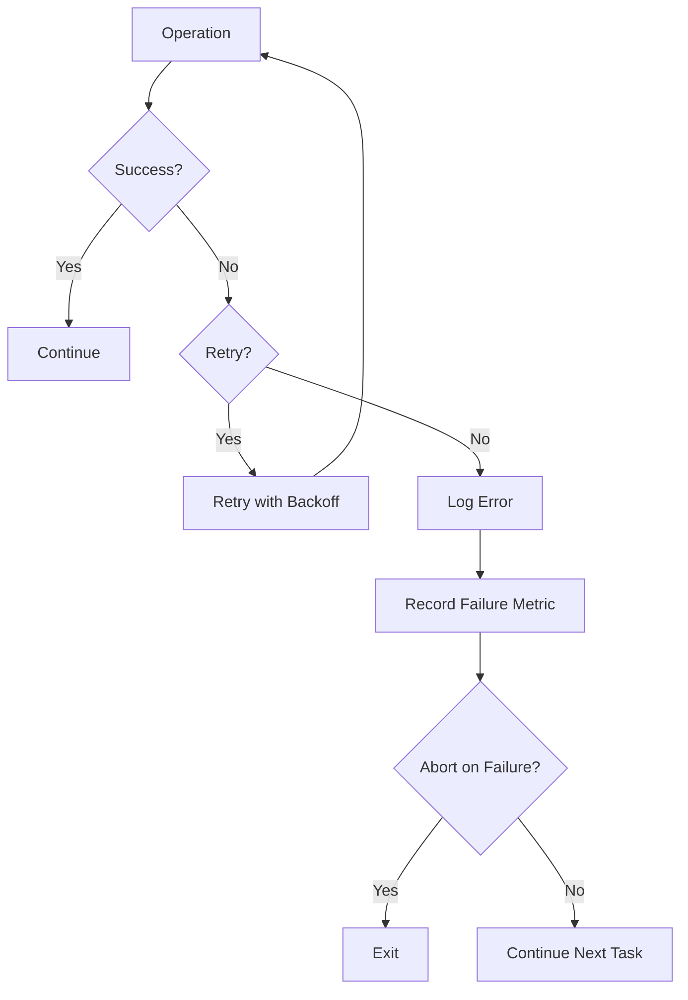

# Exgentic A2A Runner - Architecture Diagram

## System Architecture



## Sequence Diagram - Session Processing



## Component Interaction Flow



## Data Flow



## Key Design Decisions

### 1. MCP Client Implementation
- **Decision**: Use official MCP Python SDK
- **Rationale**: Avoid reinventing the wheel, leverage maintained library
- **Trade-off**: Additional dependency vs. implementation effort

### 2. Session Lifecycle
- **Decision**: Explicit create → evaluate → close pattern
- **Rationale**: Matches Exgentic MCP server design, clear resource management
- **Trade-off**: More API calls vs. cleaner separation of concerns

### 3. Sequential Execution
- **Decision**: Process one session at a time (MVP)
- **Rationale**: Simpler implementation, easier debugging, matches appworld_a2a_runner
- **Future**: Can add parallel execution later

### 4. Prompt Format
- **Decision**: Include session_id explicitly in prompt
- **Rationale**: Agent needs to know which session to use for tool calls
- **Format**: Clear instruction to use session_id in all interactions

### 5. Configuration
- **Decision**: Environment variables for all configuration
- **Rationale**: Matches appworld_a2a_runner pattern, easy deployment
- **Trade-off**: No config file support vs. simplicity

## Error Handling Strategy



## Telemetry Strategy

### Spans Hierarchy
```
exgentic_a2a.session
├── exgentic_a2a.mcp.create_session
├── exgentic_a2a.prompt.build
├── exgentic_a2a.a2a.send_prompt
│   └── HTTP spans (auto-instrumented)
├── exgentic_a2a.mcp.evaluate_session
└── exgentic_a2a.mcp.close_session
```

### Metrics
- **Counters**: sessions_total, errors_total
- **Histograms**: session_latency_ms, evaluation_latency_ms, creation_latency_ms
- **Gauges**: inflight_sessions

### Attributes
- `exgentic.session_id`
- `exgentic.mcp_server_url`
- `exgentic.evaluation_result`
- `a2a.base_url`
- `task.status`